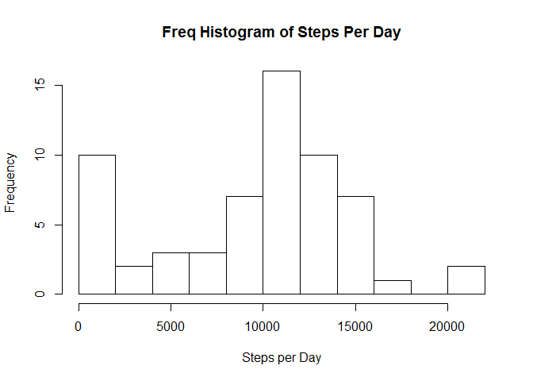
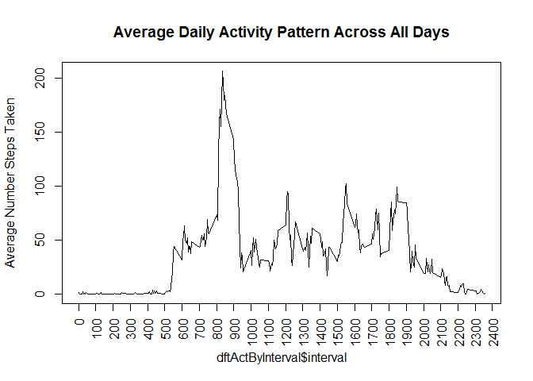
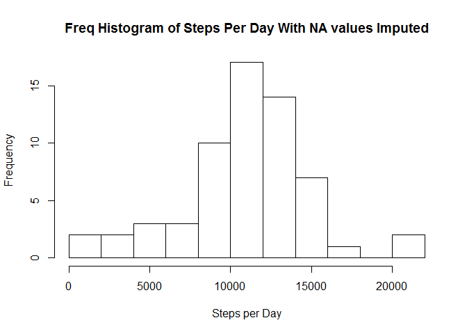
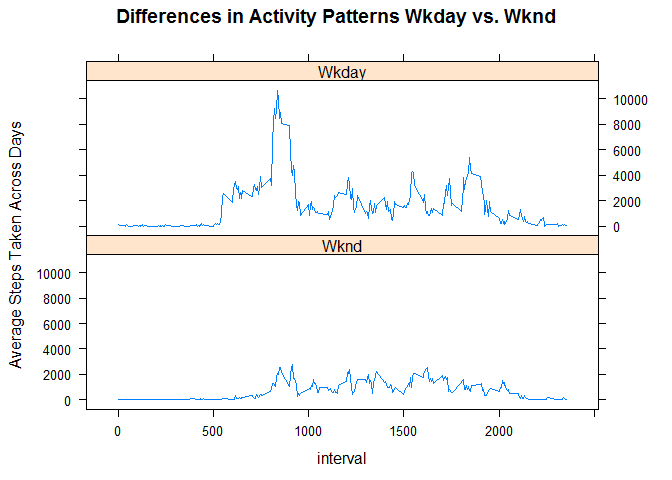

# Reproducible Research: Peer Assessment 1
Ken Karan  
`r Sys.Date()`  


## Overview

The data is about personal movement using an activity monitoring
device.  The device collects data at 5 minute intervals through out
the day.  The data consists of two months of data from an anonymous
individual between 10/2012 and 11/2012.

## Loading and preprocessing the data

### Variables
1. date:  the date the data was collected in yyyy-mm-dd format.
2. interval:  the identifier of the 5 minute interval in which the
   data was taken.
3. steps:  the numer of steps taken during the 5 minute interval.
   Missing values are coded as NA.

### Packages used

This assignment uses the dplyr and lattice packages


```r
# Activate libraries needed
library(dplyr)
```

```
## 
## Attaching package: 'dplyr'
## 
## The following object is masked from 'package:stats':
## 
##     filter
## 
## The following objects are masked from 'package:base':
## 
##     intersect, setdiff, setequal, union
```

```r
library(lattice)
```

### Source
The data was downloaded form the course website at https://d396qusza40orc.cloudfront.net/repdata%2Fdata%2Factivity.zip .

The following code was used to download and unzip the data:


```r
# Download data from internet
chrSourceFileUrl <- "http://d396qusza40orc.cloudfront.net/repdata%2Fdata%2Factivity.zip"
chrDestFileName <- "activity.zip"
download.file(chrSourceFileUrl, chrDestFileName, mode="wb")
unzip(chrDestFileName)
```

### Data format
The data is in comma delimited format.  The first row contains header
information and there are
17,569
rows of data.


```r
# Read using base/dplyr
intRows <- length(readLines("activity.csv"))
dftActivity <- tbl_df(read.table(
    file="activity.csv",
    header=T,
    sep=",",
    comment.char ="",
    stringsAsFactors=F,
    nrows=intRows
    ))
```

### Transformations

Dates must be converted to POSIXct format for use by the weekdays
function.  Day of week and logical weekend indicator is created for
the last part of this assignment.  Assign factor labels to the 
weekend indicator.


```r
# Convert date to POSIXct format
# Add day of week (dow) and weekend variables to be used in last
# portion of assignment.
dftActivity <-
    dftActivity %>%
    mutate(
        psxDate=format(date, format="%Y-%m-%d", usetz=F),
        dow=weekdays(as.POSIXct(psxDate), abb=T),
        weekend=(dow=="Sat" | dow=="Sun")
        )

# Assign English labels to values of weekend logical variable.
dftActivity$weekend <- factor(
    dftActivity$weekend,
    levels=c(T, F),
    labels=c("Wknd", "Wkday")
    )
```

## What is mean total number of steps taken per day?

The data provided is one row per time interval per day.  This data
is summarised to one row per day regardless of time interval.  A
histogram is produced and report of mean and median is printed.  As
per assignment directions, NA values are ignored.


```r
# summarise data by day
dftActByDate <- dftActivity %>%
    group_by(psxDate) %>%
    summarise(steps=sum(steps, na.rm=T)
    )

# histogram of total steps per day
hist(dftActByDate$steps,
    breaks=15,
    main="Freq Histogram of Steps Per Day",
    xlab="Steps per Day"
    )
```



```r
# report mean and median steps per day
# summary(dftActByDay$steps)[c("Median", "Mean")]
summarise(dftActByDate,
    steps_mean=round(mean(steps, na.rm=T), dig=0),
    steps_median=median(steps, na.rm=T)
    )
```

```
## Source: local data frame [1 x 2]
## 
##   steps_mean steps_median
## 1       9354        10395
```

The data shows a mostly normal distribution around the mean except for
a spike around the low end of the distribution because of the NA
values.  The mean number of steps per day is
9,354
and the median number of steps per day is
10,395
.

## What is the average daily activity pattern?

Summarizing the data across days by time interval we see that the
interval that contains the maximum number of steps is
835
.  This may correspond to walking to work.  There are additional spikes around noon, 16:00, and 19:00.  This might correspond to walking
from work or from evening activities.  There is little activity
between 22:30 and 05:30 suggesting bedtime.  The following graph
illustrates this:


```r
# What is the average daily activity pattern
# summarise by interval
dftActByInterval <-
    dftActivity %>%
    group_by(interval) %>%
    summarise(steps=mean(steps, na.rm=T))

# Plot by interval
{
plot(
    dftActByInterval$interval,
    dftActByInterval$steps,
    type="l",
    xaxt="n",
    main="Average Daily Activity Pattern Across All Days",
    ylab="Average Number Steps Taken"
    )
axis(1, at=seq(0, 3000, 100), las=2)
}
```



## Imputing missing values

There were a number of days where steps were missing.  This could be
because the subject did not wear his or her activivity monitor then.
Average numbers of steps were calculated by day of week and by
interval.  This summary data was joined with the original dataset
as follows:  

1. A column called "StepsNoNa" is created.  
2. If the steps column is missing, then it contains the average.
3. Otherwise if the steps column is not missing, then it contains the 
original steps value.


```r
# Find average steps by dow and interval
# Ignore missing data
dftDowInterv <-
    dftActivity %>%
    group_by(dow, interval) %>%
    summarise(AvgSteps=round(mean(steps, na.rm=T), dig=0))

# Join average steps to detail dataset by dow and interval
dftActivity2 <- inner_join(dftActivity, dftDowInterv, by=c("dow", "interval"))

# Create a new dataset which is the same as the old dataset but with the
# missing values filled in.  If orig steps variable is NA, then use average
# value added in last join step, otherwise use orig steps variable.
dftActivity2 <-
    dftActivity2 %>%
    mutate(StepsNoNa=ifelse(is.na(steps), AvgSteps, steps))
```

A final check of the datasets before and after the join show they
have the same number of rows.  This shows that the join worked
correctly:


```r
# Check that output of join has same number of rows as input of join
nrow(dftActivity) == nrow(dftActivity2)
```

```
## [1] TRUE
```

After summarizing the new imputed data by day, a new frequency
histogram and summary mean and median is created.


```r
# summarise data by day
dftActByDate2 <- dftActivity2 %>%
    group_by(psxDate) %>%
    summarise(steps=sum(StepsNoNa))

# histogram of total steps per day
hist(dftActByDate2$steps,
    breaks=15,
    main="Freq Histogram of Steps Per Day With NA values Imputed",
    xlab="Steps per Day")
```



```r
# report mean and median steps per day using imputed data
# summary(dftActByDay$steps)[c("Median", "Mean")]
summarise(dftActByDate2,
    steps_mean=mean(steps),
    steps_median=median(steps)
    )
```

```
## Source: local data frame [1 x 2]
## 
##   steps_mean steps_median
## 1    10821.1        11015
```

The graph shows the spike at the low end of the x axis is gone and
the data is more normally distributed.  The mean number of steps per
day is now
10,821
and the median number of steps per day is now
11,015
.  The impact of imputing the data is that both mean and median values
of total daily steps are now higher.

## Are there differences in activity patterns between weekdays and weekends?

In the first part of the assignment above, day of week and weekend
variables were created.  The imputed steps data was plotted on the
Y-axis and the time interval was plotted on the X-axis.  Two plots
were constructed:  one for weekend and another for weekday:


```r
# Differences in activity patterns on weekends
dftActByIntrvWknd <- dftActivity2 %>%
    group_by(interval, weekend) %>%
    summarise(steps=sum(StepsNoNa))

xyplot(steps ~ interval | weekend,
    data=dftActByIntrvWknd,
    type="l",
    layout = c(1, 2),
    main=list(label = "Differences in Activity Patterns Wkday vs. Wknd"),
    ylab="Average Steps Taken Across Days"
    )
```



The two plots show that there was much more activity on weekday
mornings and evenings.  Also, there is much less activity on weekends
overall.
